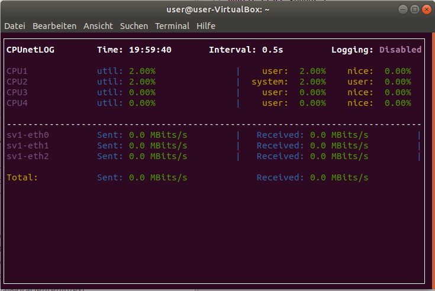
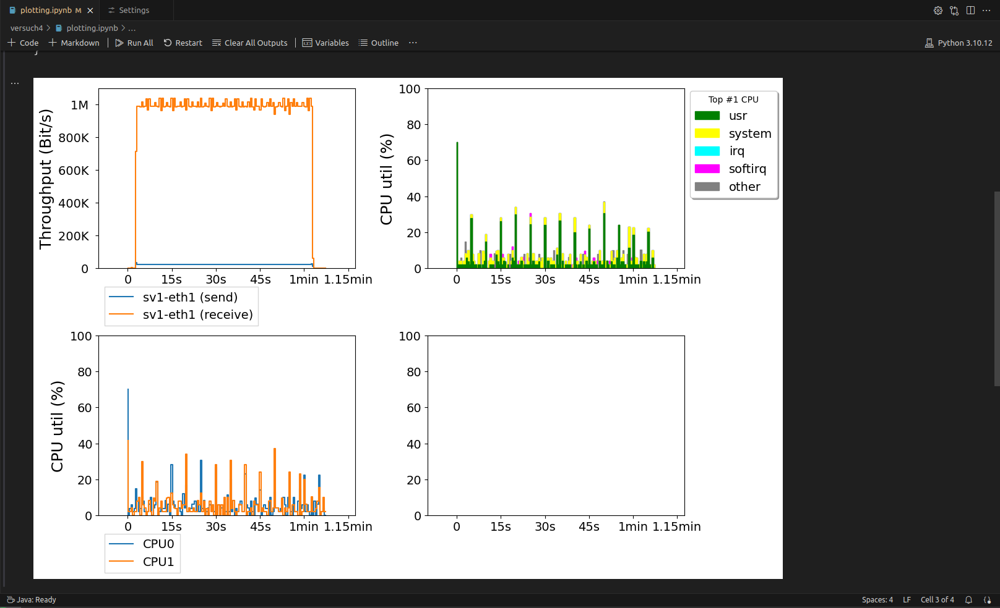
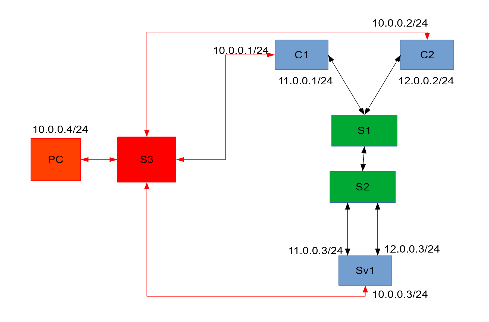

# Versuch 4 - Leistungsmessung

## Einführung

In dieser Aufgabe werden wir die Leistung von verschiedenen Transportprotokollen untersuchen und dabei Stationen betrachten, die auch in realen Netzen vorkommen können. Dazu werden wir die nachfolgend beschriebenen Werkzeuge und virtuellen Netztopologien verwenden.

### Erzeugung von Paketströmen mit `iperf3`

Das Programm `iperf3` ermöglicht das Erzeugen von TCP- und UDP-Datenströmen zwischen zwei Rechnern. `iperf3` ist eine Client-Server-Anwendung. Der Server wartet auf eingehende `iperf3`-Verbindungen. Er kann mit dem Kommando

```bash
iperf3 -s
```

gestartet werden.

Wenn der Rechner, auf dem der Server laufen soll, wie im betrachteten Fall mehrere Netzschnittstellen besitzt, kann der Server mit 

```bash
iperf3 -s -B <IP-Adresse>
```

gezielt an die Schnittstellen mit der angegebenen IP-Adresse gebunden werden. Bitte geben die IP-Adresse immer mit an und verwenden Sie **NICHT** die Adressen aus dem Subnetz `10.0.0.0/24`, denn dieses Subnetz ist nur zum Aufbau der SSH-Verbindung gedacht und hat im Gegensatz zu den anderen Netzen kein Limit für die Datenrate.

Einen Client, der einen TCP-Datenstrom erzeugt, kann man mit

```bash
iperf3 -c <IP-Adresse des Servers> -Z -t <Dauer der Übertragung>
```

starten. `-Z` bedeutet dabei "Zero copy", was die Leistung des Clients erhöht.

Einen Client, der einen UDP-Datenstrom erzeugt, kann man mit 

```bash
iperf3 -c <IP-Adresse des Servers> -Z -t <Dauer der Übertragung> -u -b <datenratenlimit>
```

erzeugen. Das Datenratenlimit ist standardmäßig auf 10 Mbit/s begrenzt und kann z.B. mit `-b 1M` auf 1 Mbit/s gesetzt werden. 

### Anzeigen / aufzeichnen des Durchsatzes mit `cpunetlog`

Das Werkzeug `cpunetlog` kann die aktuelle CPU-Auslastung und den aktuellen Netzdurchsatz eines Rechners anzeigen. Die CPU-Auslastung ist für diesen Versuch nicht relevant, daher werden wir auf den Durchsatz fokussieren. `cpunetlog` kann einfach mit dem Kommando 

```bash
cpunetlog
```

gestartet werden. *Abbildung 1* zeigt eine typische Ausgabe von `cpunetlog` auf einem Rechner mit drei Netzschnittstellen `sv1-eth0`, `sv1-eth1` und `sv1-eth2`. Das Programm kann durch Drücken der Taste `q` beendet werden.

<br>
*Abbildung 1: Ausgabe von `cpunetlog`*

Außerdem erlaubt `cpunetlog` das Aufzeichnen des zeitlichen Verlaufs von CPU-Auslastung und Netzdurchsatz zur späteren Auswertung. Diese kann mit

```bash
cpunetlog -l
# bzw. in unserem Fall mit
cpunetlog -l --nics <Liste der Schnittstellen>
```

gestartet werden, wenn der Netzdurchsatz der in der Liste angegebenen Schnittstellen aufgezeichnet werden soll (vgl. *Tabelle 1*). Im Fenster sollte dann oben rechts in der Ecke `Logging: enabled` stehen. Die Log-Dateien werden nach `/tmp/cpunetlog` geschrieben und können mit dem Kommando

```bash
cnl_plot.py -nsc 0.001 <Log-Datei>
```

grafisch dargestellt werden. `-nsc 0.001` setzt das Maximum der Datenrate auf der Y-Achse auf 1 Mbit/s. *Abbildung 2* zeigt eine beispielhafte Ausgabe. Speichern Sie bitte immer das Ergebnis von `cnl_plot.py` auf dem Schreibtisch ab und bewahren Sie es für die Abnahme auf.<br>
**Achtung: Das Plotten funktioniert nicht über eine SSH-Verbindung, daher muss das Plot-Kommando auf dem "echten" PC gestartet werden!**

<br>
*Abbildung 2: Ausgabe von `cnl_plot.py`*

Für eine Aufzeichnung lassen sich Durchschnittswerte mit dem Kommando

```bash
summary.py <Log-Datei>
```

berechnen.

## Verwendete Mininet-Topologie

Für den Versuch haben wir Ihnen in den Skripten unter `~/kn1lab/versuch4/scripts` eine Mininet-Topologie vorgegeben, die in *Abbildung 3* dargestellt ist. Die Namen der Schnittstellen aller Hosts kann *Tabelle 1* entnommen werden.

<br>
*Abbildung 3: Verwendete Mininet-Topologie*

| Server (`sv1`)             | Client-1 (`c1`)      | Client-2 (`c2`)      |
|----------------------------|----------------------|----------------------|
| sv1-eth0 (SSH)             | c1-eth0 (SSH)        | c2-eth0 (SSH)        |
| sv1-eth1 (10.11.0.3)       | c1-eth1 (10.11.0.1)  | c2-eth1 (10.12.0.2)  |
| sv1-eth2 (10.12.0.3)       |                      |                      |
| `--nics sv1-eth1 sv1-eth2` | `--nics c1-eth1`     | `--nics c2-eth1`     |

*Tabelle 1: Schnittstellen der Hosts in der Mininet-Topologie inkl. Parameter für `cpunetlog`*

Die Leistungsmessung zwischen den Rechnern `c1`, `c2` und `sv1` wird über die schwarz dargestellten Netzverbindungen und die Switches `S1` und `S2` erfolgen. Die rot dargestellten Netzverbindungen und der Switch `S3` werden lediglich zur Steuerung der Experimente verwendet. Das Mininet-Netz kann beispielsweise mit

```bash
sudo ~/kn1lab/versuch4/scripts/mininet_1.py
```

gestartet werden. Das benötigte Passwort ist `password`.

Um `iperf3` oder `cpunetlog` auf einem der Rechner `c1`, `c2` oder `sv1` zu starten, ist das Mininet-CLI nicht ausreichend. Stattdessen müssen Sie sich, während das Mininet-Skript läuft, über ein weiteres Terminal mithilfe von

```bash
ssh <Rechnername>
```

mit dem gewünschten Rechner verbinden. 

**Achtung: Bevor Sie sich mit den Rechnern verbinden können, müssen Sie einmalig das Skript [`keygen.sh`](https://github.com/owaldhorst-hka/kn1lab/blob/master/versuch4/scripts/keygen.sh) ausführen.**

## Hinweise
- Das Python Script einer Mininet-Topologie kann mit dem Befehl **quit** beendet werden.
- Alle SSH-Sessions auf Clients und Server einer Mininet-Topolgie sollten getrennt werden bevor diese geschlossen wird. Anderenfalls kann sich die VM aufhängen und sie muss neu gestartet werden!
- Je iperf-Instanz wird ein eigenes Terminal benötigt.
- Damit `cnl_plot.py` korrekt funktioniert, müssen der virtuelle Maschine mindestens zwei virtuelle Prozessoren zugeordnet werden. Die besten Ergebnisse haben wir in der Regel erzielt, wenn es **genau zwei Prozessoren** sind. Bei mehr Prozessoren werden die gemessenen Kurven nichtmehr so eindeutig. 

## Aufgabe 1 - Ein TCP-Strom

Verwenden Sie für diese Aufgabe die Mininet-Topologie `mininet_1.py`.

```bash
iperf3 -c <IP-Addresse des Servers> -Z
```

1. Generieren Sie mit Hilfe von `iperf3` einen TCP-Datenstrom zwischen Client `c1` und Server `sv1`. Dabei soll der `iperf3`-Client auf `c1` und der `iperf3`-Server auf `sv1` laufen. Ob Sie die IP-Adresse `10.11.0.3` oder `10.12.0.3` verwenden, ist Ihnen überlassen. `iperf3` gibt das Staukontrollfenster `CWND` des TCP-Datenstroms aus. Wie verhält sich dieses und wie hoch ist es, nachdem der Strom eine Weile gelaufen ist?

1. Zeichen Sie diesen Datenstrom nun auf dem Server `sv1` mit Hilfe von `cpunetlog` für 1 Minute auf und stellen Sie das Ergebnis grafisch dar. Dazu müssen Sie über ein anderes Terminal eine weitere SSH-Verbindung zu `sv1` aufbauen. Achten Sie darauf, nur die Daten der relevanten Netzwerkschnittstelle aufzuzeichnen, sowie die Plots entsprechend zu skalieren und denken Sie daran das Ergebnis für die Abgabe auf dem Schreibtisch abzuspeichern.

1. Bestimmen Sie mit `summary.py` die durchschnittliche Auslastung der Netzschnittstelle (`receive`). 

## Aufgabe 2 - Fairness

Verwenden Sie für diese Aufgabe ebenfalls die Mininet-Topologie `mininet_1.py`. Wir wollen nun untersuchen, ob sich zwei TCP-Datenströme die verfügbare Datenrate fair teilen. Dazu benötigen wir zwei Datenströme, jeweils einen von Client `c1` bzw. Client `c2` zu Server `sv1`. Zu beachten sind die zwei Netzschnittstellen des Servers `sv1`; jede befindet sich in einem anderen Subnetz. Um die zwei Datenströme mit `cpunetlog` unterscheiden zu können, ist es notwendig, dass die TCP-Ströme jeweils an einem eigenen `iperf3`-Server je Schnittstelle ankommen. Anderenfalls kann nicht zentral auf dem Server gemessen werden, welcher Datenstrom welchen Durchsatz erreicht. 

1. Erstellen Sie die notwendigen Datenströme mit `iperf3`, zeichnen Sie diese auf den Server mit `cpunetlog` für 1 Minute auf und stellen Sie das Ergebnis grafisch dar.

1. Wie war diesmal die durchschnittliche Auslastung der Netzverbindung, war diese besser oder schlechter als für einen einzelnen Strom?

1. War die Aufteilung der Datenrate fair?

1. Wiederholen Sie das Experiment, indem sie nun einen TCP-Strom gegen einen UDP-Strom testen. Was ist das Ergebnis?

## Aufgabe 3 - Auswirkungen von hohem Paketverlust auf den TCP-Durchsatz

In dieser Aufgabe simulieren wir eine schlechte Verbindung vom Client zum Server, indem wir den Paketverlust auf der Leitung zwischen den zwei Switches von 0% auf 5% erhöhen. Verwenden Sie für diese Aufgabe die Mininet-Topologie `mininet_2.py`.

1. Erstellen Sie einen TCP-Datenstrom vom Client `c1` zum Server `sv1` und zeichnen Sie diesen auf dem Server für 1 Minute auf. Wenn Sie den Wert `CWND`, den `iperf3` ausgibt, beobachten und mit dem aus Aufgabe 1.1 vergleichen, was fällt Ihnen auf? Warum ist dies so?

1. Stellen Sie das Ergebnis grafisch dar und vergleichen Sie es mit dem aus Aufgabe 1.2, achten Sie vor allem auf den durchschnittlichen Durchsatz. Weichen die Ergebnisse signifikant ab? Wenn ja, warum könnte dies so sein?

## Aufgabe 4 - Auswirkungen von hohem Paketverlust auf den UDP-Durchsatz

Verwenden Sie für diese Aufgabe die Mininet-Topologie `mininet_3.py`, in dem der Paketverlust auf der Leitung zwischen den zwei Switches auf 10% erhöht wurde.

1. Erstellen Sie einen UDP-Datenstrom vom Client `c1` zum Server `sv1`. Messen Sie nun sowohl die gesendeten Daten auf Client-Seite als auch empfangenen Daten auf Server-Seite jeweils mit `cpunetlog`. Was fällt Ihnen bezüglich der Datenrate auf, wenn Sie den Durchsatz beider Aufzeichnungen vergleichen? Was ist der Grund für dieses Verhalten?
